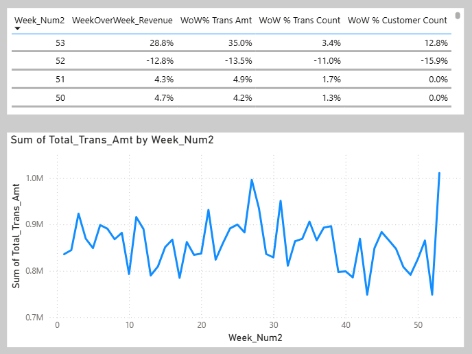
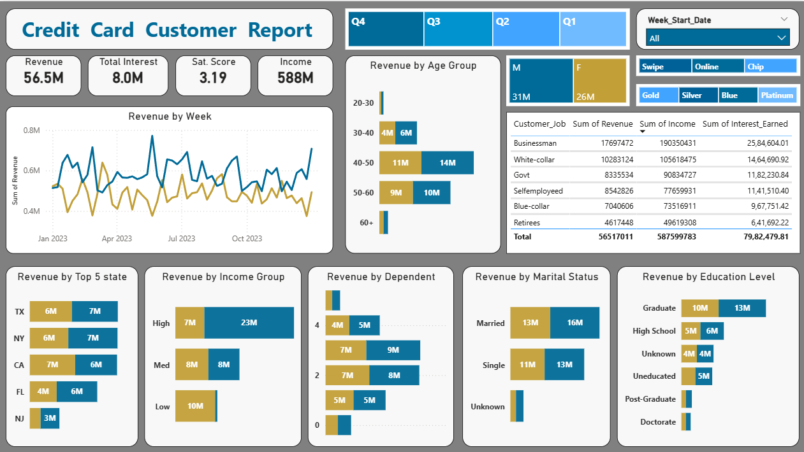
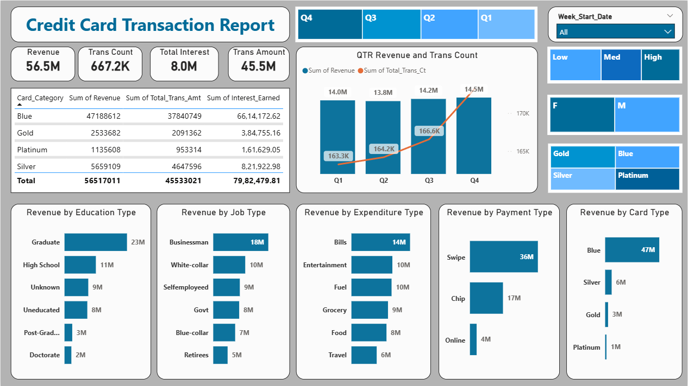

# Credit-Card-Weekly-Analytics-Dashboard
## Project Objective
To develop a comprehensive credit card weekly dashboard that provides real-time insights into key performance metrics and trends, enabling stakeholders to monitor and analyze credit card operations effectively.
## Steps
### 1. Import data to SQL database
```SQL
-- 0. Create a database 
CREATE DATABASE ccdb;

-- 1. Create cc_detail table

CREATE TABLE cc_detail (
    Client_Num INT,
    Card_Category VARCHAR(20),
    Annual_Fees INT,
    Activation_30_Days INT,
    Customer_Acq_Cost INT,
    Week_Start_Date DATE,
    Week_Num VARCHAR(20),
    Qtr VARCHAR(10),
    current_year INT,
    Credit_Limit DECIMAL(10,2),
    Total_Revolving_Bal INT,
    Total_Trans_Amt INT,
    Total_Trans_Ct INT,
    Avg_Utilization_Ratio DECIMAL(10,3),
    Use_Chip VARCHAR(10),
    Exp_Type VARCHAR(50),
    Interest_Earned DECIMAL(10,3),
    Delinquent_Acc VARCHAR(5)
);


-- 2. Create cc_detail table

CREATE TABLE cust_detail (
    Client_Num INT,
    Customer_Age INT,
    Gender VARCHAR(5),
    Dependent_Count INT,
    Education_Level VARCHAR(50),
    Marital_Status VARCHAR(20),
    State_cd VARCHAR(50),
    Zipcode VARCHAR(20),
    Car_Owner VARCHAR(5),
    House_Owner VARCHAR(5),
    Personal_Loan VARCHAR(5),
    Contact VARCHAR(50),
    Customer_Job VARCHAR(50),
    Income INT,
    Cust_Satisfaction_Score INT
);

-- 3. Copy csv data into SQL (remember to update the file name and file location in below query)

-- copy cc_detail table

BULK INSERT dbo.cc_detail
FROM 'path\credit_card.csv'
WITH (
    FIRSTROW = 2,
    FIELDTERMINATOR = ',',
    ROWTERMINATOR = '\n'
);


-- copy cust_detail table

BULK INSERT dbo.cust_detail
FROM 'path\customer.csv'
WITH (
    FIRSTROW = 2,
    FIELDTERMINATOR = ',',
    ROWTERMINATOR = '\n'
);
```

### 2. Data Processing & DAX Queries
##### In Table `cc_details`

- Created a Week by Week Report
- Created new column like Revenue, Week_Num2
- Created new measures like Current Week Revenue, Previous Week Revenue, Week Over Week Revenue Percentage

##### In Table `cust_details`

- Created Buckets for Age group and Income for easy visualization

### 3. Dashboard




### 4. Adding New Data (Next Week Data)
```SQL
BULKINSERT dbo.cc_detail
FROM'D:\cc_add.csv'
WITH (
    FIRSTROW=2,
    FIELDTERMINATOR=',',
    ROWTERMINATOR='\n'
);

BULKINSERT dbo.cust_detail
FROM'D:\cust_add.csv'
WITH (
    FIRSTROW=2,
    FIELDTERMINATOR=',',
    ROWTERMINATOR='\n'
);
```
### 5. Project Insights
## 📊 Executive Summary 

The business recorded a **strong week-over-week performance**, with revenue increasing by **28.8%**, supported by significant growth in transaction activity and customer acquisition.

---

## 📈 Growth Drivers (WoW Analysis)

- **Transaction Amount** increased by **35.0%**
- **Transaction Count** increased by **3.4%**
- **Customer Base** expanded by **12.8%**

👉 Insight: Revenue growth is primarily driven by **higher spending per transaction**, not just volume

---

## 💰 Revenue Breakdown (YTD)

- Total Revenue: **$57M**
- Transaction Revenue: **$46M**
- Interest Income: **$8M**

👉 Insight: Business is **highly transaction-driven**, with interest contributing a smaller but stable portion

---

## 👥 Customer Insights

- Male Revenue Contribution: **$31M**
- Female Revenue Contribution: **$26M**

👉 Insight: Indicates a **slight skew toward male customers**, presenting an opportunity to improve engagement among female users

---

## 💳 Product Performance

- **Blue & Silver cards account for 93%** of total transactions

👉 Insight:

- Heavy reliance on specific card categories
- Opportunity to **diversify usage across premium cards**

---

## 🌍 Regional Contribution

- **TX, NY, and CA contribute 68%** of total revenue

👉 Insight:

- Strong regional concentration
- Potential to **expand market share in other states**
